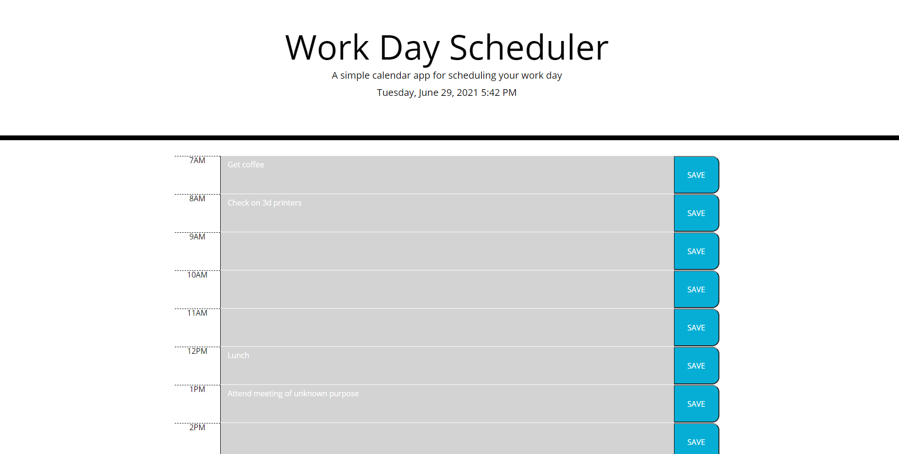

# Work-Day-Scheduler
A code refactoring project requiring me to build a work-day planner.

## Functionality
When deployed, the user is presented with a daily schedule. Each hour has an associated text input field and a SAVE button, to record the user's hourly schedule to local storage.

## Usage
No installation or deploy is required. This project is hosted live on [Github Pages](https://mlkrauz.github.io/Work-Day-Scheduler/).